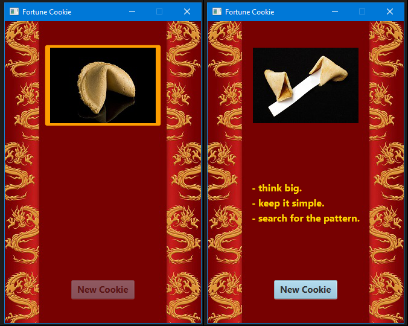

# Fortune-Cookie
A small and simple JavaFX Fortune Cookie App

A small project to practice som JavaFX by creating a Fortune Cookie App that displays fortunes read from a textfile. There are 42 fortunes that are shuffled once they are read into the app. Whenever a cookie is opened, by pressing the cokkie-button, the image changes to an opened cookie and one fortune is displayed below. Each fortune displayed is removed from the list, in order never to duplicate a fortune. A new-cookie-button is enabled permiting the user to aquire a new fortune cookie.
When all fortunes are cobnsumed all buttons are disabled, virually stopping the program.

  

